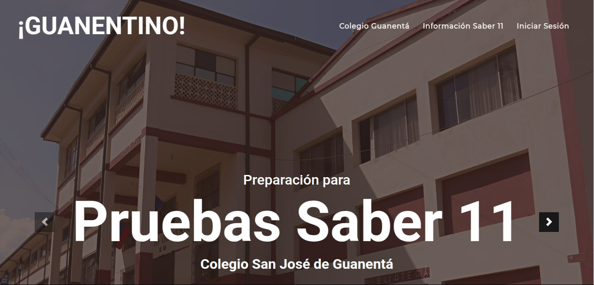
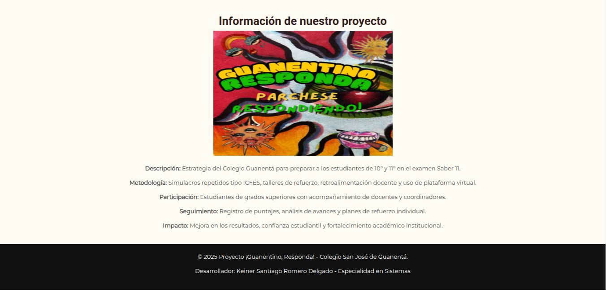
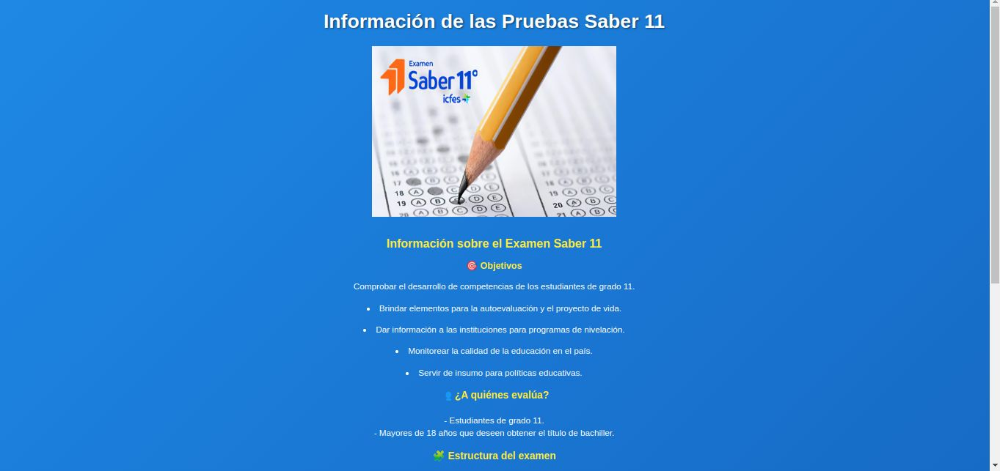
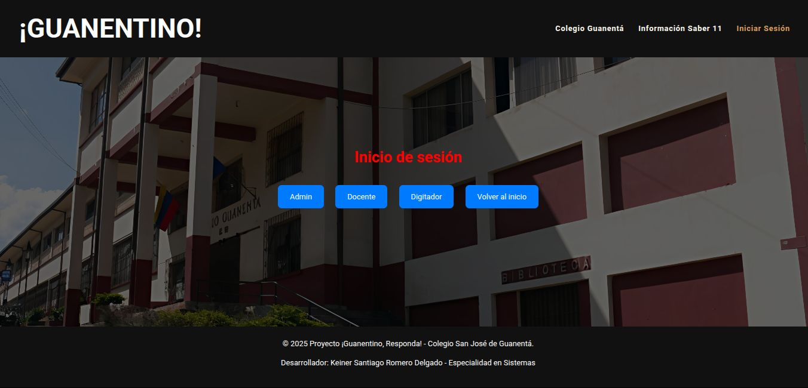

### guanentino_responda

# Pantallazos de la página

* Index

* Index 2

* Información Colegio Guanentá

* Información Saber 11

* Inicio sesión

<!DOCTYPE html>
<html lang="en">
<head>
    <meta charset="UTF-8">
    <meta name="viewport" content="width=device-width, initial-scale=1.0">
    <title>¡Guanentino, responda!</title>
    <link rel="stylesheet" href="style.css">
