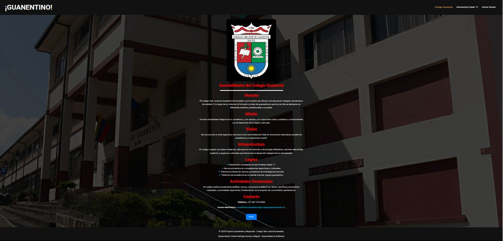

### guanentino_responda

# Pantallazos de la página

* Index

* Información Colegio Guanentá

* Información Saber 11

* Información de nuestro proyecto

* Inicio sesión

<!DOCTYPE html>
<html lang="en">
<head>
    <meta charset="UTF-8">
    <meta name="viewport" content="width=device-width, initial-scale=1.0">
    <title>¡Guanentino, responda!</title>
    <link rel="stylesheet" href="style.css">

    

        <h1>Bienvenido a ¡Guanentino, Responda!</h1>

        <h2>Información de nuestro proyecto</h2>
        

<strong>Descripción:</strong> Estrategia del Colegio Guanentá para preparar a los estudiantes de 10° y 11° en el examen Saber 11.

<strong>Metodología:</strong> Simulacros periódicos tipo ICFES, talleres de refuerzo, retroalimentación docente y uso de plataforma virtual.

<strong>Participación:</strong> Estudiantes de grados superiores con acompañamiento de docentes y coordinadores.

<strong>Seguimiento:</strong> Registro de puntajes, análisis de avances y planes de refuerzo individual.

<strong>Impacto:</strong> Mejora en los resultados, confianza estudiantil y fortalecimiento académico institucional.

 

        <a href="generalidades.php">
            <button type="submit">Colegio Guanentá</button>
        </a>

        <a href="informacion_saber.php">
            <button type="submit">Información Saber 11</button>
        </a>    
         
         
        <a href="home_inicio_sesion.php">
            <button type="submit">Iniciar sesión</button>
        </a>

        <footer>
    
&copy; 2025 Proyecto ¡Guanentino, Responda! - Colegio San José de Guanentá.

    
Autor: Keiner Santiago  Romero Delgado - Especialidad en Sistemas

</footer>

    

    <h1></h1>
</head>
<body>
    
</body>
</html>
